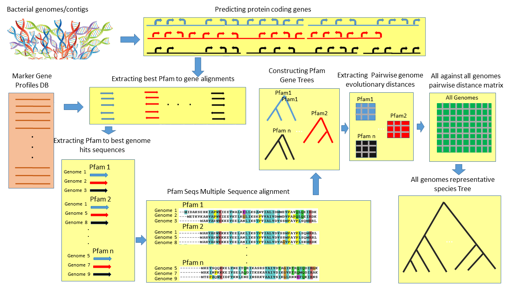

## Human_Gut_Tree

### git hub repository for human gut tree project

* The repository contains a full pipeline of building a bacterial tree of life starting from contigs and or binned genomes all the way to a tree in newick format.
* This github also includes helper scripts to annotae the tree (and the steps involved in annotating the tree)
* scripts needed to generate label files used in the metaproteomic application
* scripts needed to generate label files used in metagenomic aapplication
* scripts needed to generate bootstraps and compute confidence intervals

### Prerequisite Programs needed to run the pipeline:

* python3
* required python packages:
    * biopython
    * ete3
* Frag Gene Scan (FGS)
* HMMER3
* Bowtie2
* MUSCLE
* FastTree

    
Click [here](#setting-up-required-programs-and-packages) for details about installing/setting up prerequisites.

### Buidling Phylogenetic Tree with FastTree and MSA concatenation
In this section we will describe the steps and the code used to build a phylogenetic tree given list of contigs. The algorithm starts from a set of contigs or genomes (depending on the completeness of your datasets) to a phylogenetic tree representing these contigs. The main steps involved for this pipeline is as follows:

* [Prediction protien coding genes from contigs or genomes](#prediction-protien-coding-genes-from-contigs-or-genomes)
* [Searching for marker gene profile matches within the predicted proteins](#searching-for-marker-gene-profile-matches-within-the-predicted-proteins)
* [Extracting pfam to sequene hits and best pfam to sequence hit](#extracting-pfam-to-sequene-hits-and-best-pfam-to-sequence-hit)
* [Creating pfam multi-fasta files for multiple sequence alignments](#creating-pfam-multi-fasta-files-for-multiple-sequence-alignments)
* [Performing multiple sequence alignments using hmmalign](#performing-multiple-sequence-alignments-using-hmmalign)
* [Alignment concatentation and improvement](#alignment-concatentation-and-improvement)
* [Phylogenetic tree construction using FastTree](#phylogenetic-tree-construction-using-fasttree)

All of these steps and the code involved are explained below, to run this entire pipeline in one command we made a script that combines all the steps. This script requires 1 mandatory command line argument which is the directory where the contigs and the genome are located in fasta format. You can also satisfy the number of cores used using the -t parameters (default is 40).

To run pipleine in one command simply use the script [constructTree_FastTree_hmmalign.sh](buildTree/treeBuildingPipeline/constructTree_FastTree_hmmalign.sh).

example to run script:
```
sh constructTree.sh -i ../../genomes_dir/ -t 40
```

An overview of the pipeline is summarized in this figure:


For details about all the steps involved we refer the user [here](#buidling-phylogenetic-tree)

### Rooting the phylogenetic tree using an outgroup
In order to root out phylogenetic tree properly and to have two branches coming from the root node, we need to define an outgroup and use it to root the tree. In our bacterial tree of life example we used a set of 7 Archaea genomes whose most specific common ancestor was used as the outgroup clade. To do this we created a script called ['rootTree_usingOutgroup.py'](buildTree/treeBuildingPipeline/rootTree_usingOutgroup.py). Note that this step requires manual intervention because we need the user to spceify the outgroup genomes based on genome data used. This script requires two arguments to run:

1) input tree file 
2) directory for the output to dump the rooted tree.

This script will also prompt the used to input the genome or bin IDs for the genomes or bins to be used as the outgroup. The user should enter the IDs without the file extensions, then the script will calculate the most recent common ancestor of this list of species entered and will use that common ancestor to be the outtgroup clade.

Example to run this script:
```
pyhton3 rooTree_usingOutgroup.py ../../data/combinedTree/allPfamsAveraged_treeDist_clean_internalNodesNamed.outtree ../../data/combinedTree/
```

### Tree annotation and Taxonomic assignment using GTDBTK

There are two steps involved in annotating the tree by assigning taxonomic classifications to the nodes and coloring different clades etc... The first step involves predicting the taxonomic classifcations using GTDBTK and the second step invovles using this information to annotate the tree. It's important to note that GTDBTK still runs on python2.x and not python3. Therefore the first step should be done by using a phython2 environment.

We used GTDBTK taxonomies to assign our genomes/bins with taxonomies using the least common ancestor approach. To do this we issue the following command:

```
gtdbtk classify_wf --cpus 64 --genome_dir final_genomes/ --extension fasta --out_dir data/final_genomes.classify_wf/
```
where we specified the folder where all of these genomes/bins are found in fasta format, and the output directory for the generated files to be stored plus number of CPUs used. This command will generate different taxonomical assignment files for the different kingdoms. i.e. Archaea and Bacteria in our case. These files are called 'gtdbtk.ar122.summary.tsv' and 'gtdbtk.bac120.summary.tsv' respectively.

After obtaining taxanomic assignment information from the first step and having a phylogenetic tree using our pipeline, we can now proceed by annotating this tree. To do that we created a script called [annotate.sh](assignTaxonomies/annotateTree.sh) which executes all the steps necesarry to generate tree anotation files. This scritp requires 5 command line arguments:

1) file for the archaea taxonomic annotations produced by GTDBTK
2) file for the bacteria taxonomic annotations produced by GTDBTK
3) output directory to store the generated files
4) location for the generated phylogenetic tree file
5) taxonomic level to generate annotatation files.

Example to run this script:

```
sh annotateTree.sh -a ../data/final_genomes.classify_wf/gtdbtk.ar122.summary.tsv -b ../data/final_genomes.classify_wf/gtdbtk.bac120.summary.tsv -o ../assignTaxonomies/ -p ../data/combinedTree/allPfamsAveraged_treeDist_clean_internalNodesNamed_rooted.outtree -l phylum
```

Details about every step and all the scripts involved in annoating the phylogenetic tree could be found [here](#annotating-the-phylogenetic-tree)


### Metaproteomic Application of the gut tree

For the Metaproteomic application of our gut tree, we expect the user to provide a list of peptides sequences in fasta format to search and quantify over our tree. Peptides could be obtained by any search method which is beyond the scope of our study. We made a script that will read in peptide sequences in fasta format and will produce the necessarry iTOL importable annotation files to reflect these informations on out tree. This script could be found [here](metaproteome_application/quantifyMP.sh), that takes four command line arguments to run:

1) input file for for the peptides to be searched for (in fasta format)
2) output directory to store the generated files by this script
3) number of cores to be used when running this script
4) the taxonomical level at which the user wants to reflect these quantities (i.e. species level, genus, order etc...)

Example to run this script:

```
sh quantifyMP.sh -p peptideSeqs_unique.fasta -o ../metaproteomic_application/ -t 40 -l phylum
```
Details about every step and all the scripts involved in metaproteomic qunatification could be found [here](#quantifying-metaproteomic-data-over-the-phylogenetic-tree)


### Metagenomic Application of the gut tree

For the Metagenomic application of our gut tree, we expect the user to provide a reads mapping file in SAM format to quantify reads over our tree. The sam file could be obtained by any reads mapping program or method which is beyond the scope of our study. We made a script that will read in reads mapping in SAM format and will produce the necessarry iTOL importable annotation files to reflect these informations on out tree. This script could be found [here](metagenome_application/quantifyMG.sh), that takes two command line arguments to run:

1) input file for for the SAM file
2) output directory to store the generated files by this script

Example to run this script:

```
sh quantifyMG.sh -s SRR769523.sama -o ../metagenomic_application/
```
Details about every step and all the scripts involved in metagenomic qunatification could be found [here](#quantifying-metagenomic-data-over-the-phylogenetic-tree)


### ----------------Detail explanation of the scripts involved in the different pipelines mentioned above--------------------------

In this section we provide details of every script and every step involved in the different pipelines explained above, in case the user wants to understand and/or modify some of the steps.

### Buidling Phylogenetic Tree

#### Prediction protien coding genes from contigs or genomes
Before we start with the gene prediction we made a small helper script that will unify the genome extensions in case your genomes come from multiple sources with different extensions, this will help to be able to split genome IDs for later. The script used for that can be found [here](buildTree/treeBuildingPipeline/unifyGenomeExtensions.py). To run this script you need to specify one command line argument which is the directory where you stored the genomes. It will overwrite the same directory by using '.fasta' as the file extension.

Example to run this script:
```
python3 unifyGenomeExtensions.py ../../sample_genomes/
```

It is essential that we have a list of genes for the genomes of interest to extract marker gene information later to build the tree. Here we use FragGeneScan (FGS) in order to predict the protein coding genes.
To predict genes we made a [script](buildTree/treeBuildingPipeline/runFGS_parallel.sh), 'runFGS_parallel.sh' that calls FragGeneScan over all the contigs specified in a particular folder. This will execute FragGeneScan in parallel treating each genome/bin independantly, it will scale as much as the specified number of cores. This script takes four command line arguments:

1) input directory containing all contigs
2) number of threads used by the program.
3) output directory for the FGS to dumpt it's predicted genes and other produced files
4) extension for the files in a folder, if your contigs have more than one extension then simply do not use this parameter

Example to run this script:
```
sh runFGS_parallel.sh -i ../../sample_genomes -t 40 -o ../../data/sample_genomes.FGS

or if extension is to be specified

sh runFGS_parallel.sh -i ../../sample_genomes -t 40 -o ../../data/sample_genomes.FGS -e .fa
```

#### Searching for marker gene profile matches within the predicted proteins
The next step after gene prediction would be to scan marker gene profiles against proteins of these genes. Since we use FGS for the task of gene prediction, it also produces the translated protein sequences of these genes. 
These produced protein sequences are used to scan (search) these marker gene profiles against them. I have predefined marker gene profiles and a precompiled hmmer database which I am including with this github. The list of pfam profiles can be found [here](buildTree/treeBuildingData/ribosomal_GTP_EFTU_pfamIDs_list.txt) and the hmmer3 database is found [here](buildTree/treeBuildingData/ribosmal_GTP_EFTU_pfam_db/)
To search for significant hits betwen sequences and these predefined profiles hmmscan function from Hmmer3 is used. To do this we made the following script [script](buildTree/treeBuildingPipeline/runHMMSCAN_parallel.sh), 'runHMMSCAN_parallel.sh'. This will call hmmscan function of hmmer, and will produce two files per scanned proteome file in this case, one is a tabular file and another is a human readable file at an output folder specified by the output parameter. This script takes five command line arguments:

1) input directory containing protein sequences in fasta format
2) number of threads used by the program.
3) output directory to dump the hmmscan output
4) directory for the precompiled hmmer database
4) extension for the files in a folder, if your fasta sequences have more than one extension then simply do not use this parameter

Example to run this script:
```
sh runHMMSCAN_parallel.sh -i ../../data/sample_genomes.FGS -t 40 -o ../../data/sample_genomes.FGS_hmmscan_out -m ../treeBuildingData/ribosmal_GTP_EFTU_pfam_db/ribosomal_GTP_EFTU_profiles.hmm

or if extension is to be specified

sh runHMMSCAN_parallel.sh -i ../../data/sample_genomes.FGS -t 40 -o ../../data/sample_genomes.FGS_hmmscan_out -m ../treeBuildingData/ribosmal_GTP_EFTU_pfam_db/ribosomal_GTP_EFTU_profiles.hmm -e .faa
```

#### Extracting pfam to sequene hits, and best pfam to sequence hit
Now that we have all the hmmscan outputs, we create a [script](buildTree/treeBuildingPipeline/extractPfamSeqHits.py) called 'extractPfamSeqHits.py', that will go over the text output of hmmscan and will parse them and extract two files from each hmmscan out file. The first one will be all the hits between the pfams and the sequenes scanned against that are significant and the second one will be for each pfam the best sequence hit between that pfam and that particualr genome. The results for this scrip are to be stored in a directory specified at command line. The script will further create two directories within the specified ourput directory. This script takes 3 command line arguments:

1) input directory for the hmmscan output files
2) number of threads used by the program
3) output directory to dump the extracted sequence hits:

example to run this script:
```
python3 extractPfamSeqHits.py ../../data/sample_genomes.FGS_hmmscan_out/ 40 ../../data/
```
#### Creating pfam multi-fasta files for multiple sequence alignments
Here we use the information from the previous script and create a multi-fasta file for each pfam and their best sequence hits with each genome. Note that some pfams might not be present in some of the genomes hence they will not have representative sequecnes from those genomes. This is done by two scripts ['binID2BestPfamSeqs.py'](buildTree/treeBuildingPipeline/binID2BestPfamSeqs.py) and ['extract_profile_sequences.py'](buildTree/treeBuildingPipeline/extract_profile_sequences.py)

The script 'binID2BestPfamSeqs.py' takes two command line arguments:
1) directory for the best pfam hits directory
2) output directory to store the files

The script 'extract_profile_sequences.py' takes two command line arguments:
1) the pfams to binns to sequences dictionary of dictionaries file
2) output directory to store the files

```
python3 binID2BestPfamSeqs.py ../../data/gene2bestpfam_hits/ ../../data/

and 

python3 extract_profile_sequences.py ../../data/pfam2bins2bestPfamSeqs_dic_of_dics.json ../../data/bin2bestPfam_seqs/
```


#### Performing multiple sequence alignments using hmmalign
Now that best sequence hits between pfams and genomes are extracted in mulit-fasta format, hmmalign is used to calculate one multiple sequence alignment per pfam. To do this we use two scripts, a bash script calling hmmalign which is ['runHMMALIGN_parallel.sh'](buildTree/treeBuildingPipeline/runHMMALIGN_parallel.sh) and another bash script that contains the actual hmmalign command found [here](buildTree/treeBuildingPipeline/runHMMALIGNcommand.sh). The bash script takes four arguments:

1) input directory for the folder containing multi-fasta files
2) number of threads to be used
3) output directory for the script to dump the multiple sequence alignments (in fasta format)
4) extension of the fasta formatted sequence files found in the input directory

example to run the script:
```
sh runHMMALIGN_parallel.sh -i ../../data/bin2bestPfam_seqs -t 40 -o ../../data/pfam_MSA -e .faa
````

#### Alignment concatentation and improvement
After obtaining the multiple sequence alignments for each pfam, we convert these indivual alignments from fasta format to stockholm format using the script ['convertSeqAlignments.py'](buildTree/treeBuildingPipeline/convertSeqAlignments.py), this is followed by alignment filtering, where only the parts of the alignments that are aligned with the hmm model are kept and the rest are discarded. This is done using the script ['stockholm2RefAnnotFasta.py'](buildTree/treeBuildingPipeline/stockholm2RefAnnotFasta.py). Gaps were used to fill in the alignments for genomes with missing marker genes, which is done using the script ['fillMSAGaps.py'](buildTree/treeBuildingPipeline/fillMSAGaps.py). The individual multiple sequence alignments are then conatenated using the script ['supermat_phylo.R'](buildTree/treeBuildingPipeline/supermat_phylo.R) into a super matrix. The alignment is then transformed back to fasta format with the script ['phylip2fasta.py'](buildTree/treeBuildingPipeline/phylip2fasta.py), and refined by the script ['improveMSA.py'](buildTree/treeBuildingPipeline/improveMSA.py).

#### Phylogenetic tree construction using FastTree
After obtaining the final concatenated multiple sequence alignment from all the domains, we use FastTree to construct a final phylogenetic tree. We use FastTree under WAG and GAMMA models

example of FastTree command used:
```
FastTree -wag -gamma -pseudo -spr 4 -mlacc 2 -slownni dir/to/concatenated/msa.fasta > output/dir/to/dump/final_tree.tree
````


### Annotating the phylogenetic tree

#### Bin IDs to taxonomical mappings
After running the GTDBTK program over our genomes, we will obtain two taxonomical assignments once for bacteria and the other for archaea. We made a script that will combine these two outputs and generate a dictionary mapping, that maps between the bin IDs to the different taxonomical levels assigned to that bing or genome ID, i,e, starting to phylum all the way to species level taxonomic assignments, if that information is available. This resulting dictionary will be used later to annotate and creat labels for the tree. The script is found [here](assignTaxonomies/bins2taxonomic_assignment_GTDBTK.py). This script requires three command line arguments:

1) bacterial taxonmic assignment file
2) archaea taxonomic assignment file
3) output directory to store the this dictionary mapping between bin IDs to taxonomies.

Example to run the script:

```
python3 bins2taxonomic_assignment_GTDBTK.py ../data/final_genomes.classify_wf/gtdbtk.bac120.summary.tsv ../data/final_genomes.classify_wf/gtdbtk.ar122.summary.tsv ../data/
```

#### Bin IDs to specific level taxonomical mappings

After obtaining bin ID to taxonomic assignments, now we can start with annotating and coloring the tree at different taxonomicla levels. To do that we made a script called [extractSpecificLevelAnnotation.py](assignTaxonomies/extractSpecificLevelAnnotation.py). This script requires three command line arguments to run:

1) First command line argument is a dictionary mapping between bin IDs to different levels of taxonomic assignments, i.e. species, genus, order etc...
2) Second command line argument is the level at which the annotation is to be extractesd i.e. phylum class etc...
3) Third input is the output diretory to store the generated files.

Example to run the script:

```
python3 extractSpecificLevelAnnotation.py ../data/allBin2taxon_dic.json phylum ../data/
```

#### Annotating internal parent nodes (LCA approach)

After having taxonomica information for the leaf nodes (i.e. out species) and after having constucted a phylogenetic tree composed of all these species, we can propagate the taxonomic information to the internal parent nodes using the tree topology and the information present at the leaf nodes by least common ancestors approach. To do this we wrote a script called ['nodes2LCA_maps.py'](assignTaxonomies/nodes2LCA_maps.py). THis script takes three arguments to runL

1) mapping dictionary file between bin IDs to taxonomies.
2) file to the final rooted phylogenetic tree containing all species.
3) directory to the output to store the node to LCA maps.

Example to run the script:

```
python3 nodes2LCA_maps.py ../data/allBin2taxon_dic.json ../data/combinedTree/allPfamsAveraged_treeDist_clean_internalNodesNamed_rooted.outtree ../data/
```

#### Tree Coloring and legend labels

Now that we have a tree whose internal nodes are also named, and we also extracted internal nodes to least common ancestors mappings we can assign different colors to different clades depedning on the taxonomic levels that we want to label, i.e. phylum, class etc... To do that we made two scripts, the first one [make_iTOLcolorStylesFile.py](assignTaxonomies/make_iTOLcolorStylesFile.py) that takes 4 command line arguments and outputs and iTOL node coloring file that can be imported to the displayed tree by a simple drag and drop, the 4 command line arguments for this script are:

1) taxonomic level to bin taxa mapping dictionary
2) taxonomic level to color mappings dictionary
3) specificed taxonomic level
4) dictectory to the output

The second script we made creates and iTOL legend file for the tree colors, this is done through the script [make_iTOLColorLegendFile.py](assignTaxonomies/make_iTOLColorLegendFile.py), that also takes 4 command line arguments:

1) taxonomic level to bin taxa mapping dictionary
2) taxonomic level to color mappings dictionary
3) specificed taxonomic level
4) dictectory to the output

The resulting iTOL importable text files could be imported to the constructed tree by a simple drag and drop to the browser.

example to run these scripts:

```
python3 make_iTOLcolorStylesFile.py ../data/phylum_LevelAllBin2TaxaMap_dic.json ../data/phylum_allTaxa2colorMap_dic.json phylum ../assignTaxonomies/

python3 make_iTOLColorLegendFile.py ../data/phylum_LevelAllBin2TaxaMap_dic.json ../data/phylum_allTaxa2colorMap_dic.json phylum ../assignTaxonomies/ 
```

#### Tree node labels and pop-up information

If the user is intersted to view the entire taxonomical hierarchy of any node within the tree we made a script that generates two iTOL importable files, this script could be found [here](assignTaxonomies/make_iTOL_node_mostSpecificTaxaAssignment_labels.py), which takes 3 command line arguments to run:

1) tree file in newick format
2) al nodes to taxonomic assignment dictionary map file
3) output folder to dump generated files

example to run this script

```
python3 make_iTOL_node_mostSpecificTaxaAssignment_labels.py ../data/combinedTree/allPfamsAveraged_treeDist_clean_internalNodesNamed_rooted.outtree ../data/allNodes2taxon_dic.json ../assignTaxonomies/
```

### Quantifying Metaproteomic data over the phylogenetic tree

In this section we will explain the scripts and the steps involved in demonstrating the practicaility of the tree in a metagenomics context. Here in this case we assume the user to provide a set of peptides that have been identified before. Searching and identifying peptides is beyond the scope of this study.


#### Mapping protein sequence IDs to Bin IDs

The scripts explained in this section require a dictionary mapping between protein IDs to their genome or Bin IDs, for that we created a script that generates this dictionary, the script could be found [here](metaproteome_application/proteins2genomes.py), which takes 3 command line arguments:

1) directory to the protein sequence files
2) extension for the protein sequence files
3) directory to store the output files generated by this script

example to run this script:
```
python3 proteins2genomes.py ../data/final_genomes.FGS/ .fasta.FGS.faa ../metaproteome_application/
```

#### Peptide to protein search

Having a list of peptides, we created a script that will search these pepetides against a list of protein sequences coming from the genomes participating in constructing the phylogenetic tree.. To do this we wrote a script that does exact matching between the peptides and proteins. The script can be found [here](metaproteome_application/peptide2sequenceStringMatching.py). Since this is an exact matching it is computationally intensive, we made a parallel version of peptide matching script that is found [here](metaproteome_application/peptide2sequenceStringMatching_parallel.py). This script takes 4 command line arguments to run:

1) directory to the peptide file
2) directory to the protein sequences of the genomes (seperate amino acid fasta file for each genome)
3) directory to store the output files generated by this script
4) number of threads to use to run this script

example to run this script

```
python3 peptide2sequenceStringMatching_parallel.py peptideSeqs_unique.fasta ../data/final_genomes.FGS/ protein2peptideMatches/ 70
```

#### Peptide to genome map counts

This step involves quantifying the number of peptides being mapped to the genomes. To do this we first use a [script](metaproteome_application/peptide2genomeMapping2LCA_stringMatches.py). This script takes 5 command line arguments to run:

1) peptide to protein match file generated by the previous script
2) file containing all the peptides in fasta file
3) dictionary mapping proteins to genomes generated by (metaproteome_application/proteins2genomes.py) script
4) dictionary file mapping all bins to taxonomies
5) output directory to store the files generated by this script

example to run this script

```
python3 peptide2genomeMapping2LCA_stringMatches.py peptide2allProteinMatches.txt peptideSeqs_unique.fasta  proteins2genomesNames_dic.json ../data/allBin2taxon_dic.json ../metaproteome_application/
```

#### Creating iTOL peptide abundance and symbols file

Now that we have all the necesarry information we can create iTOL importable files to reflect the abundance of genomes from a metaproeomics perspective. To do that we created two scripts the first one called [make_iTOL_node_mostSpecificTaxaAssignment_peptideMapCounts.py](metaproteome_application/make_iTOL_node_mostSpecificTaxaAssignment_peptideMapCounts.py) which takes 6 comamnd line arguments to run:

1) path to the phylogenetic tree created
2) all bins to taxonomies dictionary mapping file
3) all nodes to taxonomies dictionary mapping file
4) genomes to peptides dictionary mapping file
5) peptides to all genomes dictionary mapping file
6) output directory to store files generated by this script

The second script is used to generate an iTOL importable labels file which reflects the quantities of peptides mapped to each of participating genomes. The script generating the symbol file is [make_iTOLSymbolFileFromPeptideCountsDic.py](metaproteome_application/make_iTOLSymbolFileFromPeptideCountsDic.py) which takes 3 command line arguments:

1) all nodes to taxonomies dictionary mapping file
2) node name to number of peptides mapped dictionary file (generated by (metaproteome_application/make_iTOL_node_mostSpecificTaxaAssignment_peptideMapCounts.py))
3) output directory to store files generated by this script

example to run these scripts:

```
python3 make_iTOL_node_mostSpecificTaxaAssignment_peptideMapCounts.py  ../data/combinedTree/allPfamsAveraged_treeDist_clean_internalNodesNamed_rooted.outtree ../data/allBin2taxon_dic.json ../data/allNodes2taxon_dic.json peptide2allProteinMatches_allGenomes2Peptides_dic.json peptide2allProteinMatches_Peptides2allGenomes_dic.json ../metaproteome_application/

python3 make_iTOLSymbolFileFromPeptideCountsDic.py ../data/allNodes2taxon_dic.json nodeName2NpeptidesMapped_dic.json ../metaproteome_application
```

### Quantifying Metagenomic data over the phylogenetic tree

In this section we will explain the scripts and the steps involved in demonstrating the practicaility of the tree in a metagenomics context. Here in this case we assume the user to provide a SAM reads mapping file. Mapping the reads and creating search databases is beyond the scope of this study.

#### mapped reads to abundance quantification

Once we have a reads mapping file available, we made a script that will quantify the relative abundances of each of the participating genomes in our study. We made a script that does that which could be accessed [here](metagenome_application/samRead2multiFastaGenomeAbundance.py). This script requires 3 command line arguments to run:

1) path to the sam file
2) path to the output abundance file to be generated
3) directory containing all the genome files participating in the tree in multi-fasta format (1 file per genome).

The genome fasta files are used to map all the contigs coming from one genome to that genome, since often these genomes are given to us in scaffolds and it is important to map all contigs to their respective bins for the normalization step during quantification.

example to run this script

```
python3 samRead2multiFastaGenomeAbundance.py  SRR769523.sam SRR769523_abundances.txt ../metagenome_application/
```

#### Creating iTOL relative species composition label and symbol files

Now that we have relative abundance information for each of the genoems that have reads being mapped to them we can create iTOL importable label files and symbol files to reflect these values on the trees. To do that we have made two scripts that are [make_iTOL_node_mostSpecificTaxaAssignment_MGAbundance.py](metagenome_application/make_iTOL_node_mostSpecificTaxaAssignment_MGAbundance.py), and [make_iTOLSymbolFileFromMGAbundanceDic.py](metagenome_application/make_iTOLSymbolFileFromMGAbundanceDic.py). The first script requires 5 command line arguments to run:

1) tree file in newick format
2) all bins to taxonomies map dictionary 
3) all nodes to taxonomies map dictionary file
4) relative abunance dictionary file generated by the [previous script](metagenome_application/samRead2multiFastaGenomeAbundance.py) script
5) output directory to store the generated iTOL importable file

to run the second script, it rquires 3 command line arguments

1) all nodes to taxonomies map dictionary file
2)node names to metagenomic relative abundance map dictionary file generated by the script metagenome_application/make_iTOL_node_mostSpecificTaxaAssignment_MGAbundance.py)
3) output directory to store the generated iTOL importable file

example to run scripts

```

python3 make_iTOL_node_mostSpecificTaxaAssignment_MGAbundance.py ../data/combinedTree/allPfamsAveraged_treeDist_clean_internalNodesNamed_rooted.outtree ../data/allBin2taxon_dic.json ../data/allNodes2taxon_dic.json SRR769523_abundances.txt ../metagenome_application/

python3 make_iTOLSymbolFileFromMGAbundanceDic.py ../data/allNodes2taxon_dic.json nodeName2MGPercentageAbundance_dic.json ../metagenome_application/

```


## Setting up required programs and packages

#### Python3 and Anaconda3
Installing python3 through anaconda suite, will install alot ofthe python packages used and will make it easy to install additional packages through conda. Anaconda3 package could be obtained through:
```
wget https://repo.anaconda.com/archive/Anaconda3-2018.12-Linux-x86_64.sh
sh Anaconda3-2018.12-Linux-x86_64.sh
and then follow the installation instructions.
```

##### Installing biopython and ete3 python packages
```
conda install -c anaconda biopytho
conda install -c etetoolkit ete3 
```


#### Frag Gene Scan
Frag Gene Scan is used to predicted protein coding genes from the contigs. It could be downloaded from sourceforge:
```
wget https://sourceforge.net/projects/fraggenescan/files/latest/download/FragGeneScan1.31.tar.gz
tar -zxvf FragGeneScan1.31.tar.gz
add the path to FragGeneScan to $PATH variable in ~/.bashrc file
export PATH="/home/mstambou/tree_match_pipeline/tree_match_prereqs/FragGeneScan1.31:$PATH"
```

#### hmmer3
hmmer3 is used for creating marker gene database also searching for marker genes based on a predefined database, using the hmmscan functionality. hmmer could be downloaded from:
```
wget http://eddylab.org/software/hmmer/hmmer.tar.gz
tar -zxvf hmmer.tar.gz
cd hmmer-3.2.1/
./configure --prefix
./configure --prefix /home/mstambou/tree_match_pipeline/tree_match_prereqs/hmmer-3.2.1
 make
 make check
 make install
 add the path to hmmer to the $PATH variable in ~/.bashrc file
 export PATH="/path/to/hmmer/hmmer-3.2.1/bin:$PATH
```
#### BOWTIE2
BOWTIE2 is used to map the reads back to the contigs, and create SAM files. BOWTIE2 could be obtained from:
```
wget https://sourceforge.net/projects/bowtie-bio/files/latest/download/bowtie2-2.3.4.3-source.zip
unzip bowtie2-2.3.4.3-source.zip
add assign the path to bowtie2 to the variable $BT2_home, in ~/.bashrc file.
export BT2_HOME="/path/to/bowtie2/bowtie2-2.3.4.3"
make
```
If make gives errors you might have to switch back to the default gcc compiler, rather than homebrew's one, and then make.

#### MUSCLE
MUSCLE is used to peform multiple sequence allignment between the sequences belonging to the same maker gene classes. MUSCLE could be obtained from:
```
wget https://www.drive5.com/muscle/downloads3.8.31/muscle3.8.31_i86linux64.tar.gz
tar -zxvf muscle3.8.31_i86linux64.tar.gz
make the binary executable
chmod +x /path/to/muscle/muscle3.8.31/muscle3.8.31_i86linux64
add the path to MUSCLE to the $PATH variable in ~/.bashrc file
export PATH="/path/to/cd-hit/muscle3.8.31:$PATH"
```

#### FastTree
FastTree is used to build a phylogenetic tree from the multiple sequence allignments obtained by MUSCLE. FastTree could be obtained from:
```
wget http://www.microbesonline.org/fasttree/FastTree
chmod +x /path/to/FastTree/FastTree
add the path to FastTree to the $PATH variable in ~/.bashrc file
export PATH="/path/to/FastTree:$PATH"
```

### Prerequisite Programs needed to run the GTDBTK to annotate species:

* python2
* required python packages:
    * dendropy
    * future
    * Matplotlib
    * Numpy
    * Scipy
* Prodigal
* pplacer
* FastANI
* FastTree
* GTDBTK

Click [here](#setting-up-GTDBTK) for details about installing/setting up prerequisites.


## Setting up GTDBTK
#### Python2 and Anaconda2
Installing python3 through anaconda suite, will install alot ofthe python packages used and will make it easy to install additional packages through conda. Anaconda3 package could be obtained through:
```
wget https://repo.anaconda.com/archive/Anaconda2-2019.03-Linux-x86_64.sh
sh Anaconda2-2019.03-Linux-x86_64.sh
and then follow the installation instructions.
```
to install pyhton2 packages:
```
conda install -c bioconda dendropy
pip install future
conda install -c conda-forge matplotlib
conda install -c anaconda numpy 
conda install -c anaconda scipy 

```

#### Prodigal

to install Prodigal follow these steps:
```
git clone https://github.com/hyattpd/Prodigal.git.
cd Prodigal
make install
make install
```

#### installing pplacer

to install pplacer we need to install a number of other packages first:

```
wget https://github.com/matsen/pplacer/releases/download/v1.1.alpha19/pplacer-linux-v1.1.alpha19.zip
unzip the folder
make sure to add the directory into the path variable
```

#### installing FastANI

instructions:
```
git clone https://github.com/ParBLiSS/FastANI.git
cd FastANI
./configure
make  (note that when making the binaries, this might throw an error depending on the version of your g++, make sure you have a gcc compiler version 5 or newer)
```

#### FastTree

download FastTree exectuable and add it's directory to the path variable.

#### GTDBTK

download and install GTDBTK.

data needed to be downloaded:
```
wget https://data.ace.uq.edu.au/public/gtdb/data/releases/release89/89.0/gtdbtk_r89_data.tar.gz
tar xvzf gtdbtk_r89_data.tar.gz
wget https://data.ace.uq.edu.au/public/gtdbtk

```
installing the package:

pip install gtdbtk

download and unpack taxonomical information for gtdbtk to function:

wget https://data.ace.uq.edu.au/public/gtdb/data/releases/release89/89.0/gtdbtk_r89_data.tar.gz
tar xvzf gtdbtk_r89_data.tar.gz
wget https://data.ace.uq.edu.au/public/gtdbtk

set the GTDBTK_DATA_PATH variable to point where these datasets were downloaded.
```


